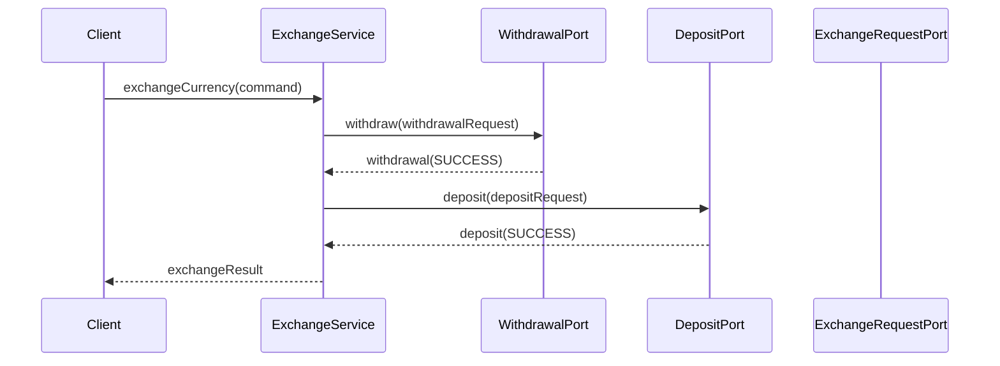
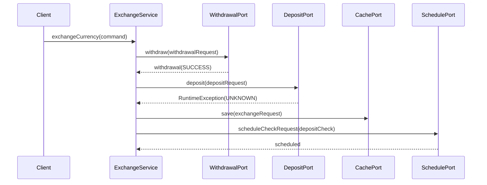
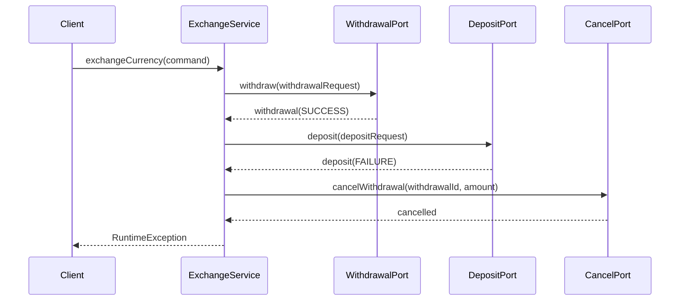

# 환전 서비스 아키텍처 설계

## 프로젝트 개요
- **프로젝트명**: 외환 거래 마이크로서비스 시스템
- **기술 스택**: Spring Boot, Java, MSA, Saga Pattern, Event-Driven Architecture
- **역할**: 백엔드 개발 및 시스템 아키텍처 설계

---

## 핵심 설계 패턴

### 1. Saga Pattern을 활용한 분산 트랜잭션 관리
환전 프로세스의 출금 → 입금 → 완료 단계를 Saga 패턴으로 구현하여 데이터 일관성을 보장

### 2. 지연 확인 메커니즘 (Delayed Confirmation)
외부 시스템 응답 지연 시 스케줄링된 재확인 메커니즘으로 시스템 안정성 확보

### 3. 재시도 정책 (Retry Policy)
최대 4회 재시도 후 경고 메시지 발송으로 시스템 모니터링 강화

---

## 주요 시나리오별 플로우

### 정상 플로우

### 지연 확인 플로우

### 실패 복구 플로우 (롤백)

---

## 주요 상태 정의

| 상태                        | 설명                                 | 다음 가능 상태                                      |
|-----------------------------|--------------------------------------|-----------------------------------------------------|
| `XCHANGE_CURRENCY_STARTED`   | 환전 요청 접수                       | `WITHDRAWAL_SUCCEEDED`, `CHECKING_WITHDRAWAL_REQUIRED`, `EXCHANGE_CURRENCY_FAILED` |
| `CHECKING_WITHDRAWAL_REQUIRED`| 출금 처리 중 (결과 모름)             | `WITHDRAWAL_SUCCEEDED`, `EXCHANGE_CURRENCY_FAILED`      |
| `WITHDRAWAL_SUCCEEDED`        | 출금 완료                            | `EXCHANGE_CURRENCY_SUCCEEDED`, `CHECKING_DEPOSIT_REQUIRED`, `CANCELING_WITHDRAWAL_REQUIRED` |
| `CHECKING_DEPOSIT_REQUIRED`   | 입금 처리 중 (결과 모름)             | `EXCHANGE_CURRENCY_SUCCEEDED`, `CANCELING_WITHDRAWAL_REQUIRED` |
| `EXCHANGE_CURRENCY_SUCCEEDED` | 환전 완료                            | -                                                   |
| `CANCELING_WITHDRAWAL_REQUIRED` | 환전 취소 (롤백)                   | -                                                   |
| `EXCHANGE_CURRENCY_FAILED`    | 환전 실패                            | -                                                   |

---

## 기술적 성과

### 1. 시스템 안정성 향상
- **Saga 패턴**: 분산 트랜잭션의 데이터 일관성 보장
- **재시도 메커니즘**: 외부 시스템 장애 시 자동 복구
- **롤백 처리**: 실패 시 원자성 보장

### 2. 확장성 및 유지보수성
- **헥사고날 아키텍처**: 도메인과 인프라 분리
- **포트-어댑터 패턴**: 외부 시스템과의 느슨한 결합
- **이벤트 기반 설계**: 시스템 간 비동기 통신

### 3. 모니터링 및 운영
- **경고 메시지**: 시스템 이상 시 즉시 알림
- **상태 로깅**: 거래 상태 추적 및 감사
- **캐시 활용**: 성능 최적화

## 주요 구현 내용

### 핵심 비즈니스 로직
- 환전 요청 처리 및 상태 관리
- 출금/입금 프로세스 오케스트레이션
- 실패 시 자동 롤백 처리

### 인프라 레이어
- 외부 시스템 연동 (출금/입금 API)
- 스케줄링 서비스 (지연 확인)
- 캐시 및 로깅 시스템

### 테스트 전략
- **10가지 시나리오**: 정상/실패/지연/재시도 케이스
- **통합 테스트**: 전체 플로우 검증
- **단위 테스트**: 각 컴포넌트 독립 검증

---

## 프로젝트 성과
- **장애 복구**: 자동 롤백으로 데이터 무결성 보장
- **운영 효율성**: 모니터링 및 알림으로 안정 운영

---

## 상세 시나리오
- [API_SPEC.md](./docs/API_SPEC.md)
- [CLASS_DIAGRAM.md](./docs/CLASS_DIAGRAM.md)
- [CONCURRENCY-ISSUE.md](./docs/CONCURRENCY-ISSUE.md)
- [FLOWCHART.md](./docs/FLOWCHART.md)
- [SEQUENCE-DIAGRAMS.md](./docs/SEQUENCE-DIAGRAMS.md)
