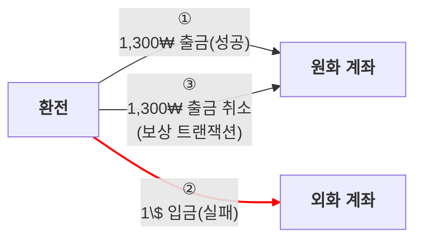
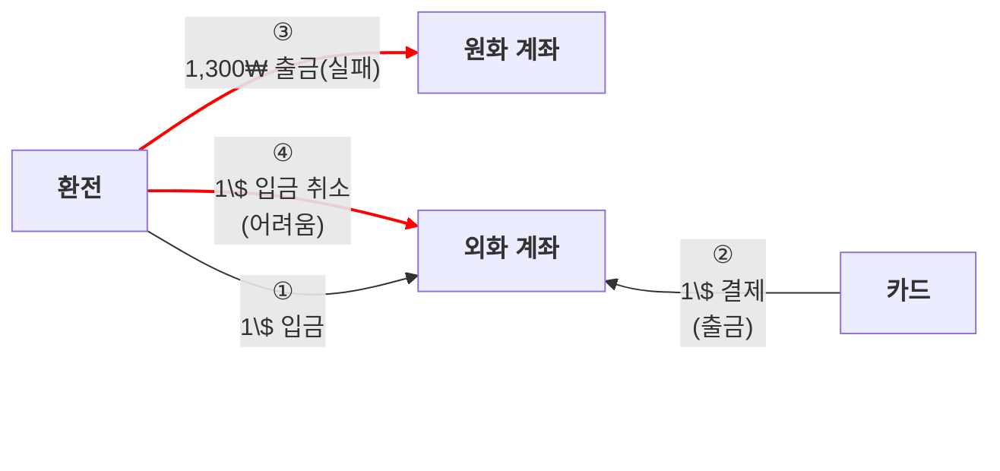

# ❓ 문제: MSA의 복잡한 트랜잭션 보장 과정

-  환전 프로세스는 크게 두 가지 주요 단계('원화 출금', '외화 입금')로 구성됨
- 원화 출금은 성공했지만, 외화 입금이 실패한다면 사용자 계좌의 데이터가 불일치하게 됨
  - 모놀리식 시스템에서는 입출금을 단일 트랜잭션으로 묶어 rollback을 통해 쉽게 해결 가능
  - MSA에서는 각 서비스가 독립적인 DB를 가지므로 이러한 방식은 불가능

</br></br>


# ❗ 해결: Saga 기반 보상 트랜잭션

- FxBank 환전 서비스는 Saga 패턴을 사용하여 분산 트랜잭션의 결과적 일관성을 보장
- Saga 패턴은 일련의 **로컬 트랜잭션**으로 구성되며, 각 로컬 트랜잭션은 다음 로컬 트랜잭션을 **트리거**하는 **이벤트** 발행
- Saga의 어느 단계에서든 실패가 발생하면, 이전에 성공했던 로컬 트랜잭션들을 되돌리는 **보상 트랜잭션**을 실행해 전체 Saga 롤백

</br></br>

## 1. 기술 선택의 이유 및 장점

### 1.1. 데이터 결과적 일관성 보장

*   분산된 서비스 간의 데이터 불일치 문제를 해결하고, 비즈니스 트랜잭션의 결과적 일관성을 보장

</br></br>

### 1.2. 서비스 간 낮은 결합도

*   각 서비스는 자신의 로컬 트랜잭션만 관리하고 이벤트 기반으로 통신하므로, 서비스 간의 직접적인 의존성이 낮아짐

</br></br>

### 1.3. 높은 가용성

- 각 서비스가 독립적으로 동작하므로 더 높은 가용성을 제공

*   2PC 같은 전통적인 분산 트랜잭션 방식은 코디네이터의 장애가 전체 시스템의 가용성에 영향을 미칠 수도

</br></br>

### 1.4. 분산 데드락 방지


*   2PC와 달리 잠금(Lock)을 사용하지 않아, 분산 데드락 발생 위험이 없음

</br></br>

## 2. 단점 및 트레이드오프

### 2.1. 복잡성 증가

*   각 로컬 트랜잭션과 보상 트랜잭션을 정의하고, 이벤트 흐름을 관리해야 해, 구현이 복잡하고 디버깅이 어려움

</br></br>

### 2.2. 결과적 일관성

- Saga가 완료되기 전까지 데이터가 일시적으로 불일치 상태가 돼,사용자에게 노출되는 중간 상태에 대한 고려가 필요

</br></br>

### 2.3. 보상 트랜잭션 구현

모든 로컬 트랜잭션에 대해 보상 트랜잭션을 구현해야 하며, 보상 트랜잭션 자체도 실패할 수 있는 가능성을 고려해야

</br></br>

## 3. 다른 기술과의 비교 및 적합성

### 3.1. 2PC(Two-Phase Commit)

*   2PC는 분산 트랜잭션의 즉각적인 일관성을 보장하지만, 서비스 간의 강한 결합도, 분산 데드락 가능성 존재
*   MSA 환경에서는 이러한 단점 때문에 잘 사용되지 않음

</br></br>

### 3.2. Saga 패턴

*   Saga 패턴은 2PC의 단점을 보완하며 MSA에 더 적합한 분산 트랜잭션 관리 방식

</br></br>

---

# ❓ 문제: Saga 패턴의 중간 상태 노출과 금전 오류 위험

- 사가 진행 중에 사용자가 계좌를 조회하면, 중간 상태(출금-미입금, 입금-미출금)가 노출됨
- 중간 상태에서 사용자 계좌 상태의 변동이 발생하면, 금전 오류 문제가 발생할 수도

</br></br>

# ❗ 해결: 출금 작업을 Saga의 첫 단계로 배치

- 금전 오류 문제 방지를 위해, 출금 작업을 환전 Saga 첫 번째 단계로 배치




- 입금부터 처리하면 환전 종료 이전에 다른 트랜잭션에서 입금된 금액을 출금해 갈 수 있음



</br></br>

---

# ❓ 문제: 분산 트랜잭션 상태 추적이 어려움

- 원화/외화 계좌 서비스가 각각 메세지 브로커를 이용해 다음 로컬 트랜잭션을 트리거하도록 구현할 수 있음
- 하지만 중앙 제어자가 없어, 현재 진행중인 트랜잭션 상태 추적 및 디버깅이 어려움

</br></br>

# ❗ 해결: Orchestration Saga

- 환전 서버가 오케스트레이터가 되어, 각 서비스들에게 트랜잭션과 보상 트랜잭션을 명령하면서 진행
  - 클라이언트 요청을 받아 환전을 시작하는 환전 서버가 필요
  - 현재 진행 중인 환전 상태 관리 필요

</br></br>

* 중앙 집중식 오케스트레이터를 사용하여 Saga의 흐름을 명확하게 제어하고 관리
  * 복잡한 Saga의 흐름을 한눈에 파악하고 디버깅하기 용이

</br></br>


## 1. 구현

### 1.1. ExchangeCurrencySagaOrchestratorImpl

- `startExchange()`: 원화 출금(`withdrawService.withdraw()`)과 외화 입금(`depositService.deposit()`)을 순차적으로 호출

- `DepositFailed`,`DepositFailureChecked` 이벤트 발생:  원화 출금 취소(`cancelWithdrawalService.cancelWithdrawal()`)를 호출하여 보상 트랜잭션 실행 

- `WithdrawalSuccessChecked` 이벤트 발생: 출금 성공을 비동기적으로 확인한 경우, 환전 실패로 간주하고 보상 트랜잭션을 호출

```java
public class ExchangeCurrencySagaOrchestratorImpl implements ExchangeCurrencySagaOrchestrator {

    // ... (생략) ...

    @Override
    public ExchangeDetail startExchange(ExchangeRequest toBeRequested) {
        var requested = createExchangeRequestService.createExchangeRequest(toBeRequested);
        var withdrawn = withdrawService.withdraw(requested); // 1. 원화 출금
        var deposited = depositService.deposit(requested);   // 2. 외화 입금
        var exchanged = completeExchangeRequestService.succeedExchange(requested);
        return new ExchangeDetail(withdrawn, deposited, exchanged);
    }

    // 입금: 실패 시 보상 트랜잭션 (출금 취소)
    @Override
    public void handle(DepositFailed event) {
        // 출금 취소
        cancelWithdrawalService.cancelWithdrawal(
                event.exchangeId(),
                event.direction()
        );
    }

    // 입금 확인: 실패 확인 시 보상 트랜잭션 (출금 취소)
    @Override
    public void handle(DepositFailureChecked event) {
        // 출금 취소
        cancelWithdrawalService.cancelWithdrawal(
                event.exchangeId(),
                event.direction()
        );
    }

    // 출금 확인: 성공 확인 시 보상 트랜잭션 (출금 취소)
    @Override
    public void handle(WithdrawalSuccessChecked event) {
        // 출금 취소
        cancelWithdrawalService.cancelWithdrawal(
                event.exchangeId(),
                event.direction()
        );
    }
}
```

</br></br>

## 2. 기술 선택의 이유 및 장점

### 2.1. 중앙 집중식 제어 및 가시성

*   오케스트레이션 방식은 트랜잭션의 전체 흐름이 오케스트레이터 한 곳에 명시적으로 정의됨
*   복잡한 환전 프로세스를 한눈에 파악하고, 디버깅 및 유지보수가 용이해짐

</br></br>

### 2.2. 서비스 간 낮은 결합도

*   참여하는 서비스들은 전체 워크플로우를 알 필요 없이, 오케스트레이터의 명령에만 응답하면 됨
*   서비스 간 직접적인 통신이 없어 독립적인 개발과 배포가 가능

</br></br>

## 3. 단점 및 트레이드오프

### 3.1. 오케스트레이터의 단일 장애점(SPOF) 가능성

 *   오케스트레이션 방식은 모든 로직이 중앙 오케스트레이터에 집중됨
 *   따라서 오케스트레이터 자체가 병목 현상을 유발하거나 장애 발생 시 전체 Saga가 중단될 수 있는 위험이 존재
 *   물론, 오케스트레이터의 다중화 등으로 보완 가능

</br></br>

## 4. 다른 기술과의 비교 및 적합성

### 4.1. Choreography Saga

#### 4.1.1. 동작 방식

*   중앙 지휘자 없이, 각 서비스가 자신의 작업을 완료한 후 이벤트를 발행
*   다음 순서를 맡은 다른 서비스가 해당 이벤트를 구독하고 있다가 자신의 작업을 시작

</br></br>

#### 4.1.2. 장점

*   새로운 서비스를 추가하기 쉽고, 중앙 오케스트레이터가 없어 단일 장애점이 없음

</br></br>

#### 4.1.3. 단점

*   전체 트랜잭션의 흐름을 파악하기 위해 여러 서비스의 코드를 모두 추적해야 하고 디버깅이 어려움
*   서비스 간 순환 의존성이 발생할 위험도 존재

</br></br>

#### 4.1.4. 적합성

*   참여하는 서비스가 적고, 'A가 끝나면 B가 시작'되는 것처럼 **단순하고 선형적인 워크플로우**에 적합

</br></br>

### 4.2. Orchestration Saga

#### 4.2.1. 동작 방식

*   중앙의 '오케스트레이터'가 전체 비즈니스 프로세스의 흐름을 알고, 각 서비스에게 명시적으로 명령을 내림
*    `ExchangeCurrencySagaOrchestratorImpl`가 오케스트레이션 작업을 수행

</br></br>

#### 4.2.2. 장점

*   전체 트랜잭션의 흐름이 오케스트레이터 코드 한 곳에 집중되어 있어 **이해하고 추적하기 용이**

</br></br>

#### 4.2.3. 단점

- 모든 비즈니스 로직이 오케스트레이터에 집중되어 오케스트레이터 자체가 **단일 장애점(SPOF)**이 될 수도

</br></br>

#### 4.2.4. 적합성

*   여러 단계로 구성되고 조건부 분기가 발생하는 등 **복잡한 워크 플로우**를 가질 때 적합
*   중앙에서 흐름을 제어하는 것이 전체적인 안정성과 관리 용이성을 높여줌

</br></br>

- FxBank 환전 서비스는 금융 거래의 특성상 데이터 정합성과 트랜잭션 흐름의 명확한 관리가 매우 중요

- 시스템의 복잡성을 일부 감수하더라도, 안정적이고 신뢰할 수 있는 환전 서비스를 제공하기 위함

- 클라이언트 요청을 받아 환전을 시작하는 환전 서버가 오케스트레이터 역할을 수행
