```mermaid
classDiagram
    %% --- 엔티티/모델 ---
    class ExchangeRequest {
        - ExchangeId exchangeId
        - UserId userId
        - BaseCurrency baseCurrency
        - BaseAmount baseAmount
        - QuoteAmount quoteAmount
        - ExchangeRate exchangeRate
        - Direction direction
        - ExchangeState state
    }
    class Deposit {
        - DepositId depositId
        - UserId userId
        - Amount amount
        - CurrencyCode currency
        - DepositStatus status
    }
    class Withdrawal {
        - WithdrawalId withdrawalId
        - UserId userId
        - Amount amount
        - CurrencyCode currency
        - WithdrawalStatus status
    }
    class ExchangeDetail {
        - ExchangeRequest exchangeRequest
        - Withdrawal withdrawal
        - Deposit deposit
    }

    %% --- VO(Value Object) ---
    class ExchangeId
    class UserId
    class BaseCurrency
    class BaseAmount
    class QuoteAmount
    class ExchangeRate
    class DepositId
    class WithdrawalId
    class Amount

    %% --- ENUMS ---
    class ExchangeState
    class CurrencyCode
    class Direction
    class DepositStatus
    class WithdrawalStatus

    %% --- 이벤트 ---
    class ExchangeCurrencyStarted
    class ExchangeCurrencySucceeded
    class ExchangeCurrencyFailed
    class WithdrawalSucceeded
    class WithdrawalSuccessChecked
    class WithdrawalUnknown
    class DepositFailed
    class DepositFailureChecked
    class DepositUnknown

    %% --- 관계 ---
    ExchangeRequest --> ExchangeId
    ExchangeRequest --> UserId
    ExchangeRequest --> BaseCurrency
    ExchangeRequest --> BaseAmount
    ExchangeRequest --> QuoteAmount
    ExchangeRequest --> ExchangeRate
    ExchangeRequest --> Direction
    ExchangeRequest --> ExchangeState

    Deposit --> DepositId
    Deposit --> UserId
    Deposit --> Amount
    Deposit --> CurrencyCode
    Deposit --> DepositStatus

    Withdrawal --> WithdrawalId
    Withdrawal --> UserId
    Withdrawal --> Amount
    Withdrawal --> CurrencyCode
    Withdrawal --> WithdrawalStatus

    ExchangeDetail --> ExchangeRequest
    ExchangeDetail --> Withdrawal
    ExchangeDetail --> Deposit

    %% --- ENUM 관계 ---
    ExchangeRequest --> ExchangeState
    ExchangeRequest --> Direction
    ExchangeRequest --> CurrencyCode

    Deposit --> DepositStatus
    Withdrawal --> WithdrawalStatus

    %% --- 이벤트 관계 (예시) ---
    ExchangeCurrencyStarted ..> ExchangeRequest
    ExchangeCurrencySucceeded ..> ExchangeRequest
    ExchangeCurrencyFailed ..> ExchangeRequest
    WithdrawalSucceeded ..> Withdrawal
    DepositFailed ..> Deposit

    %% --- 예외 (생략, 필요시 추가) ---
```

# 클래스 다이어그램 (Class Diagram)

본 프로젝트의 주요 도메인 구조와 관계를 나타냅니다.

---

---

- 실제 구현 클래스/VO/이벤트/enum의 상세 내용은 `/src/main/java/com/boldfaced7/fxexchange/exchange/domain/` 하위 폴더를 참고하세요.
- 관계는 주요 도메인 흐름과 이벤트 연동 위주로 표현하였습니다.

> 참고: [hhplus-e-commerce CLASS_DIAGRAM.md](https://github.com/boldfaced7/hhplus-e-commerce/blob/main/docs/CLASS_DIAGRAM.md) 스타일을 참고하여 작성하였습니다. 