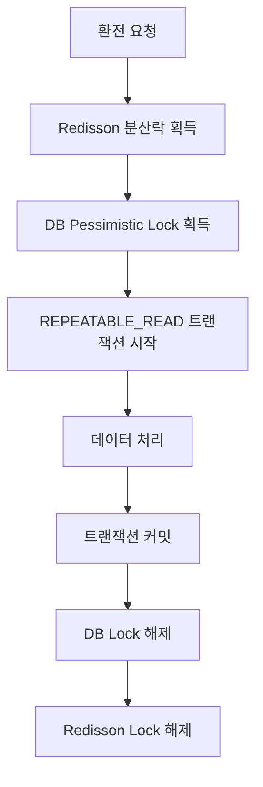

# 📖 동시성 이슈/설계

## 1️⃣ 동일한 환전 요청의 중복 처리

### 문제 상황 및 내부 구조

- 동일한 `requestId`로 여러 요청이 동시에 들어올 경우, 환전 거래가 중복 처리될 수 있음
- 환전 요청 조회 -> 환전 상태 업데이트 -> 이벤트 발행 과정에서 데이터 불일치 발생 가능
- 환전 도메인에서 중복 처리 시 잔액 부정확, 거래 내역 중복 문제 발생

### 해결 전략

- 환전 완료 처리는 데이터 정합성이 매우 중요한 로직이므로, 다층적 락 전략 적용
  - **DB Lock : 비관적 락**
https://github.com/boldfaced7/springboot-msa-foreign-exchange/blob/main/exchange-service/src/main/java/com/boldfaced7/fxexchange/exchange/adapter/out/persistence/exchange/ExchangeRequestJpaRepository.java#L13-L20

- 분산 환경에서의 동시성 제어를 위해 Redisson 분산락 사용
  - **분산 락 : Redisson**
https://github.com/boldfaced7/springboot-msa-foreign-exchange/blob/main/exchange-service/src/main/java/com/boldfaced7/fxexchange/exchange/application/service/saga/exchange/impl/CompleteExchangeServiceImpl.java#L24-L32

- 트랜잭션 격리 수준은 데이터 정합성을 위해 REPEATABLE_READ로 설정
  - **트랜잭션 격리 수준 : REPEATABLE_READ**
https://github.com/boldfaced7/springboot-msa-foreign-exchange/blob/main/exchange-service/src/main/java/com/boldfaced7/fxexchange/exchange/application/service/saga/exchange/impl/CompleteExchangeServiceImpl.java#L25-L26

- 데드락 방지
  - **DB 락 타임아웃 설정 (1초)**
  - **분산 락 대기 시간 제한 (5초)**
  - **분산 락 임대 시간 설정 (3초)**

---

## 2️⃣ 환전 완료 시점의 데이터 정합성

### 문제 상황 및 내부 구조

- 환전 성공/실패 처리 중 동시 접근 시 상태 업데이트 충돌, 이벤트 중복 발행 문제 발생
- 환전 요청 조회 -> 상태 변경 -> 이벤트 발행 -> 저장 과정에서 동시성 이슈
- 거래 상태 불일치, 이벤트 처리 오류로 인한 시스템 불안정성 초래

### 해결 전략

- 환전 완료 처리에 AOP 기반 분산락 적용으로 동시성 제어
  - **AOP 분산락 구현**
https://github.com/boldfaced7/springboot-msa-foreign-exchange/blob/main/exchange-service/src/main/java/com/boldfaced7/fxexchange/exchange/adapter/aop/DistributedLockAspect.java#L25-L84

- 멱등성 보장을 위한 락 키 설계
  - **락 키 : requestId 기반**
https://github.com/boldfaced7/springboot-msa-foreign-exchange/blob/main/exchange-service/src/main/java/com/boldfaced7/fxexchange/exchange/application/port/aop/DistributedLock.java#L8-L29

- 자동 락 해제로 데드락 방지
  - **임대 시간 기반 자동 해제 (3초)**
  - **finally 블록에서 명시적 해제**

---

## 3️⃣ 외부 시스템 호출 시 동시성

### 문제 상황 및 내부 구조

- 출금/입금 API 동시 호출 시 외부 시스템의 일시적 장애로 데이터 불일치 발생
- 외부 API 호출 -> 결과 확인 -> 상태 업데이트 과정에서 네트워크 지연/장애
- 거래 실패, 롤백 처리 복잡성으로 인한 시스템 안정성 저하

### 해결 전략

- 외부 시스템 호출에 대한 재시도 정책 적용
  - **최대 4회 재시도 후 경고 메시지 발송**
https://github.com/boldfaced7/springboot-msa-foreign-exchange/blob/main/exchange-service/src/main/java/com/boldfaced7/fxexchange/exchange/application/service/saga/deposit/impl/CheckDepositServiceImpl.java#L35-L45

- 지연 확인 메커니즘으로 시스템 안정성 확보
  - **스케줄링된 재확인 메커니즘**
https://github.com/boldfaced7/springboot-msa-foreign-exchange/blob/main/exchange-service/src/main/java/com/boldfaced7/fxexchange/exchange/adapter/in/messaging/DepositCheckKafkaConsumer.java#L19-L66

- 캐시를 활용한 상태 관리
  - **Redis 기반 상태 캐싱**
https://github.com/boldfaced7/springboot-msa-foreign-exchange/blob/main/exchange-service/src/main/java/com/boldfaced7/fxexchange/exchange/adapter/out/cache/RedisExchangeRequestCacheAdapter.java#L1-L57

---

## 4️⃣ 다층적 락 전략의 결합 효과

### 정합성 보장

### 멱등성 보장
- **Redisson Lock**: 동일 `requestId`에 대한 중복 처리 방지
- **DB Lock**: 데이터 업데이트 시 정합성 보장
- **트랜잭션**: 원자성 보장

### 데드락 방지
- **타임아웃 설정**: DB Lock 1초, Redisson Lock 5초
- **락 순서**: 항상 Redisson → DB 순서로 획득
- **자동 해제**: Redisson Lock의 임대 시간(3초) 후 자동 해제

---

## 5️⃣ 상세 테스트 코드
  - [ExchangeCurrencyServiceApplicationTest.java](https://github.com/boldfaced7/springboot-msa-foreign-exchange/blob/main/exchange-service/src/test/java/com/boldfaced7/fxexchange/exchange/application/service/saga/ExchangeCurrencyServiceApplicationTest.java) 