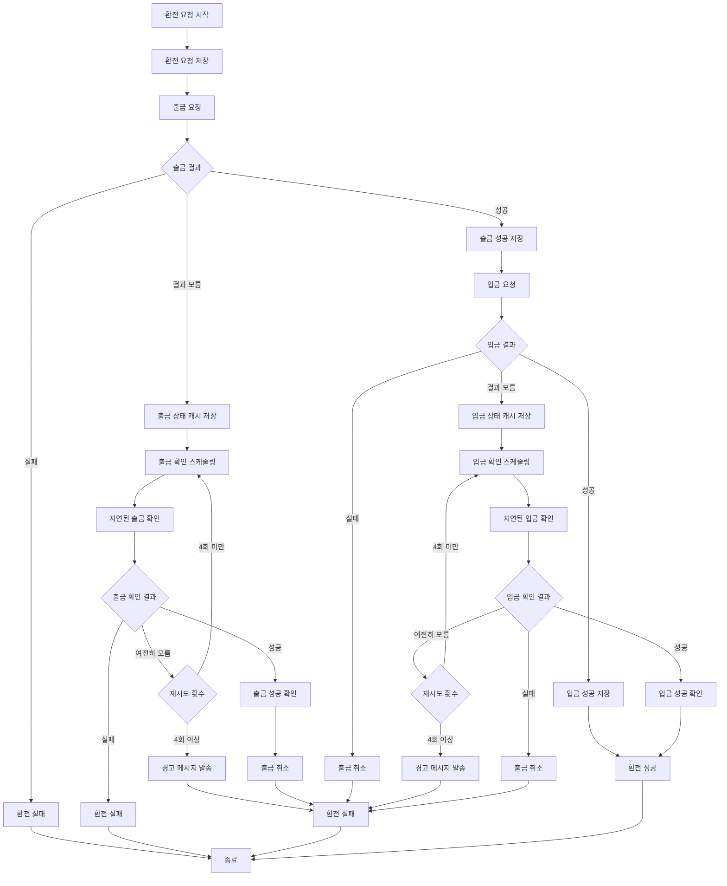
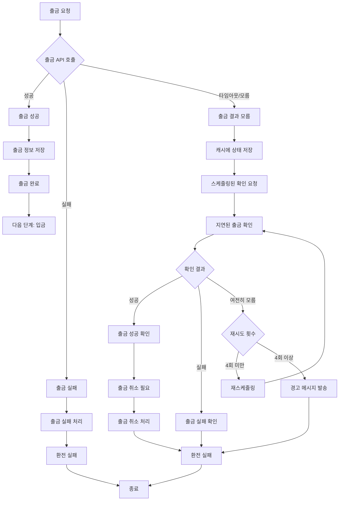
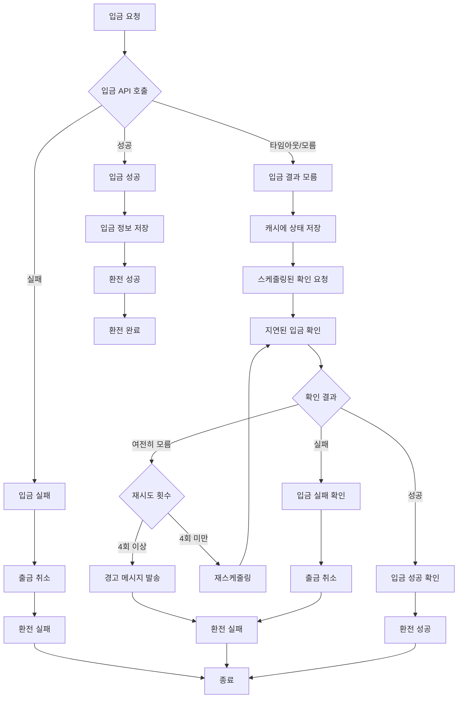
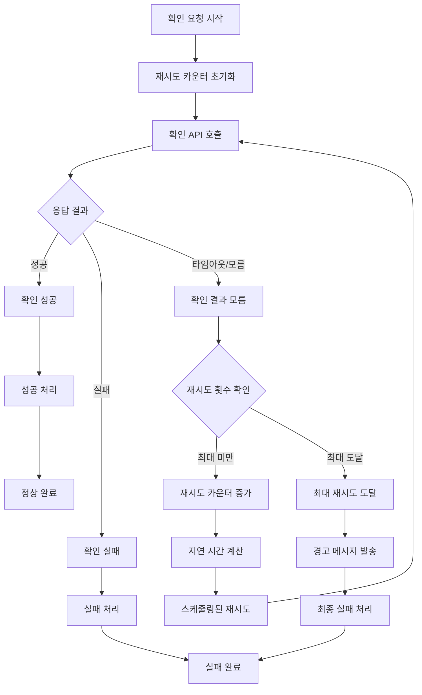
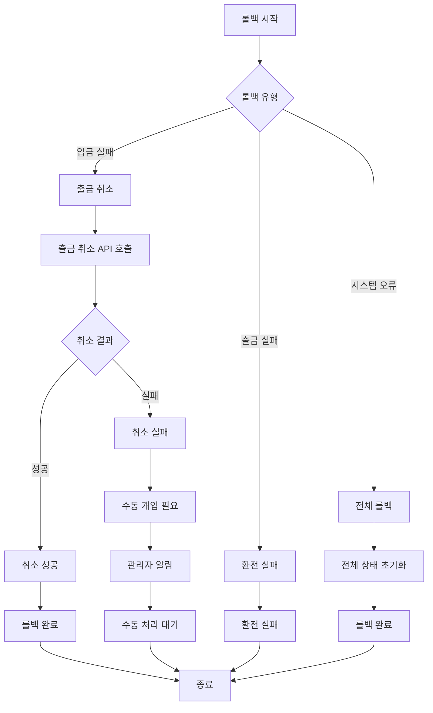
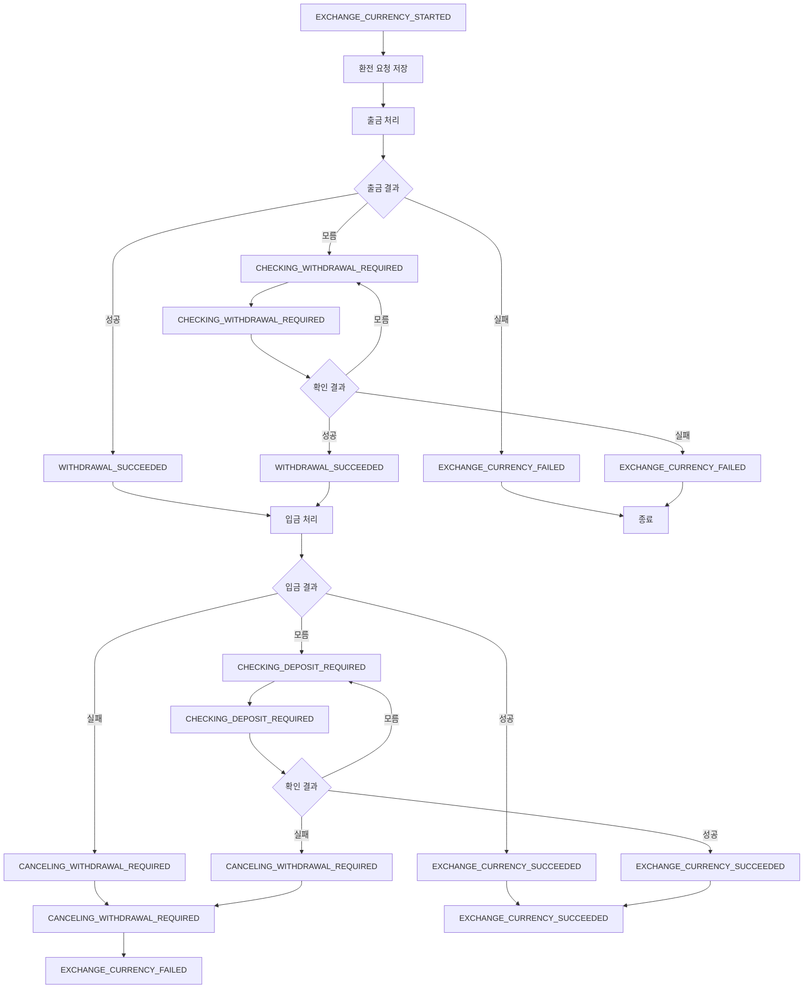
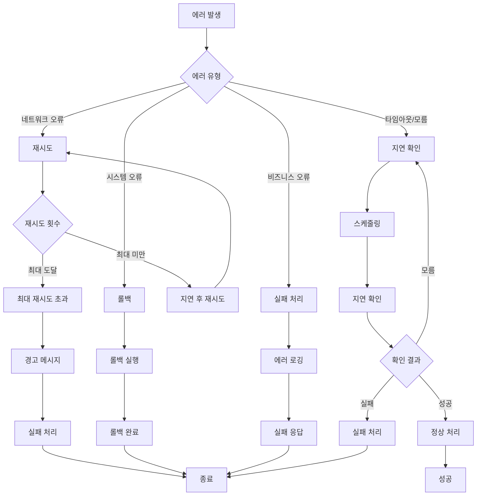

# 환전 서비스 플로우차트

## 전체 환전 프로세스 플로우

## 출금 프로세스 상세 플로우

## 입금 프로세스 상세 플로우

## 재시도 정책 플로우

## 롤백 처리 플로우

## 상태 관리 플로우

## 주요 상태 정의

| 상태 | 설명 | 다음 가능 상태 |
|------|------|----------------|
| `EXCHANGE_CURRENCY_STARTED` | 환전 요청 접수 | `WITHDRAWAL_SUCCEEDED`, `CHECKING_WITHDRAWAL_REQUIRED`, `EXCHANGE_CURRENCY_FAILED` |
| `CHECKING_WITHDRAWAL_REQUIRED` | 출금 처리 중 (결과 모름) | `WITHDRAWAL_SUCCEEDED`, `EXCHANGE_CURRENCY_FAILED` |
| `WITHDRAWAL_SUCCEEDED` | 출금 완료 | `EXCHANGE_CURRENCY_SUCCEEDED`, `CHECKING_DEPOSIT_REQUIRED`, `CANCELING_WITHDRAWAL_REQUIRED` |
| `CHECKING_DEPOSIT_REQUIRED` | 입금 처리 중 (결과 모름) | `EXCHANGE_CURRENCY_SUCCEEDED`, `CANCELING_WITHDRAWAL_REQUIRED` |
| `EXCHANGE_CURRENCY_SUCCEEDED` | 환전 완료 | - |
| `CANCELING_WITHDRAWAL_REQUIRED` | 환전 취소 (롤백) | - |
| `EXCHANGE_CURRENCY_FAILED` | 환전 실패 | - |

## 에러 처리 플로우

