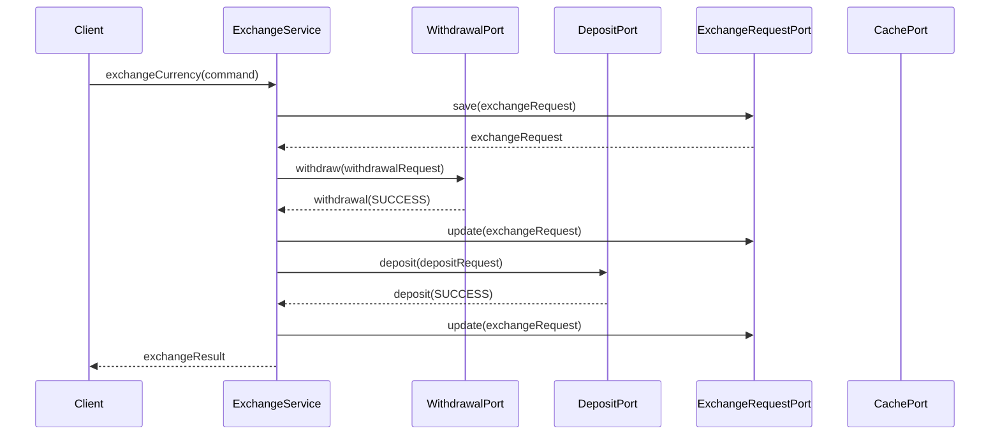
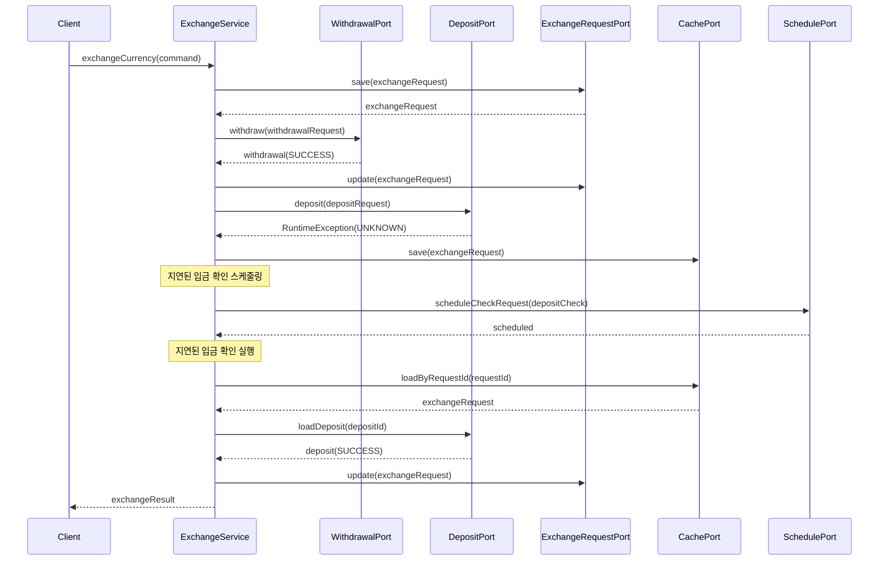
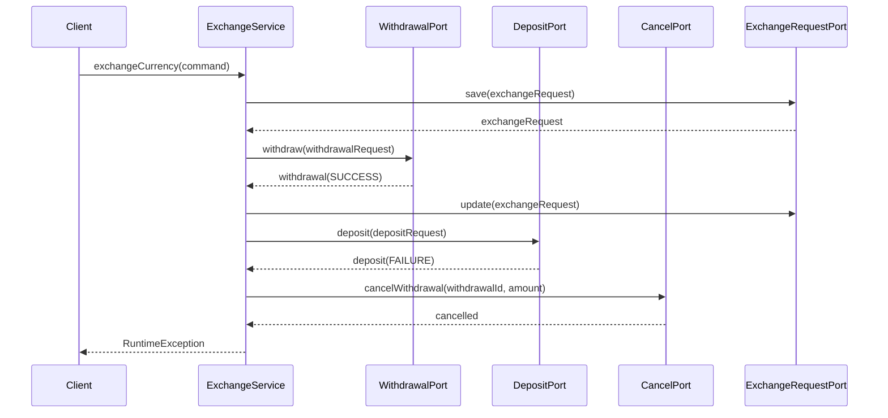
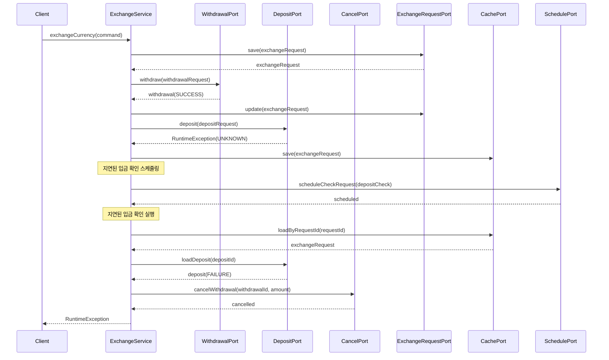
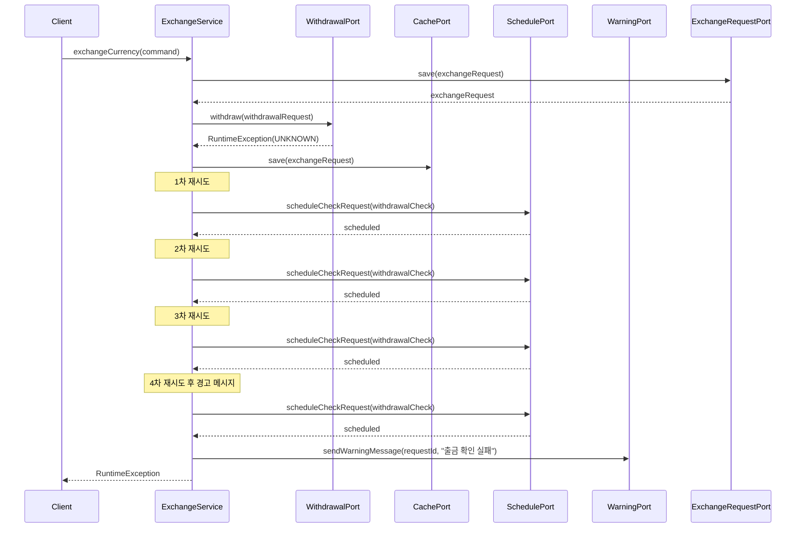
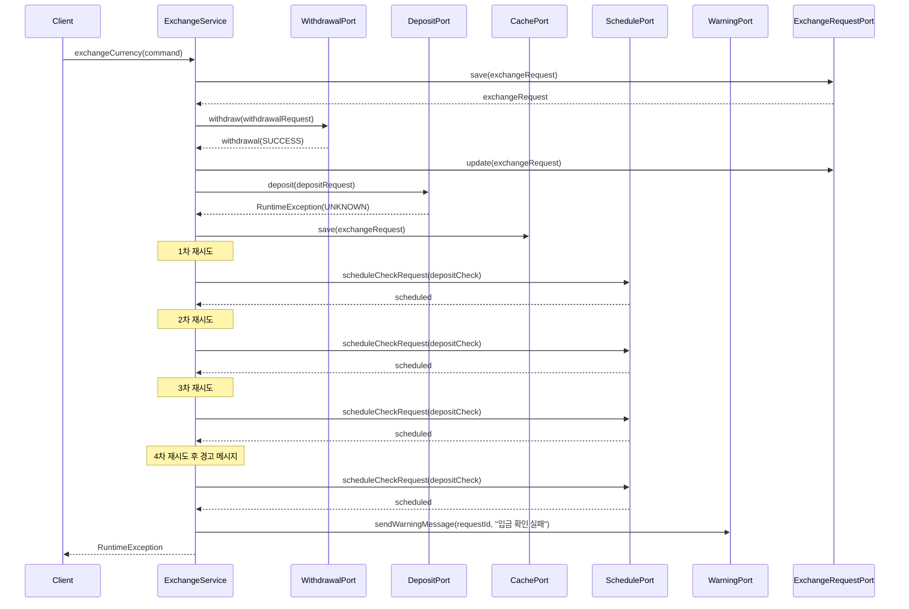
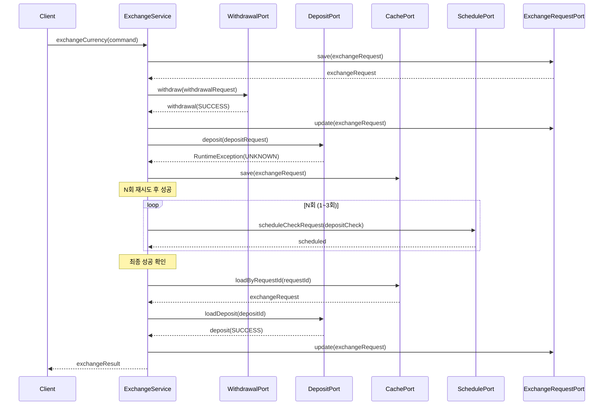
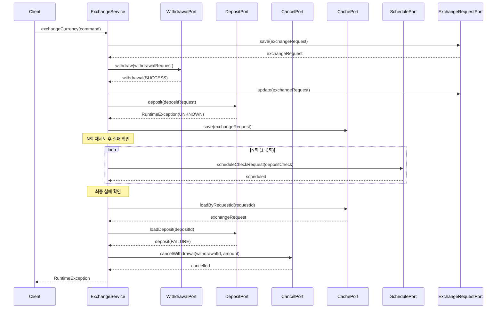
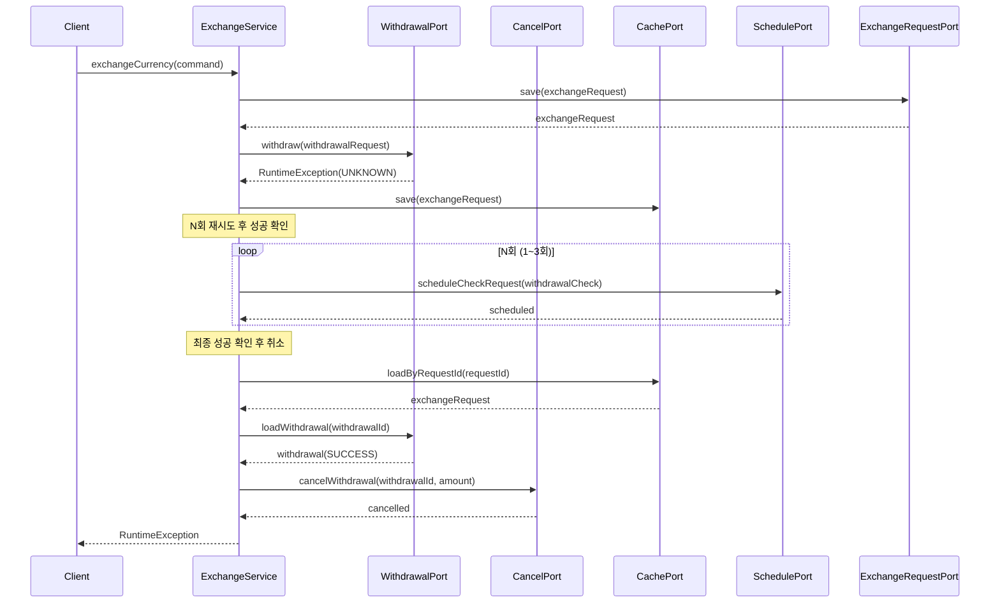
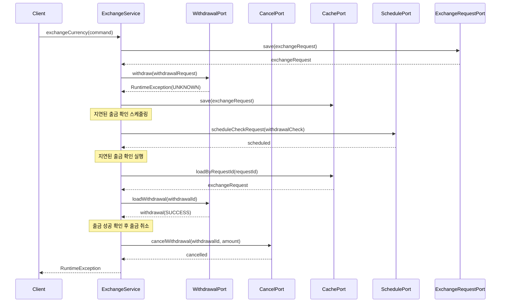

# 환전 서비스 시퀀스 다이어그램

## 1. 출금 성공 → 입금 성공 → 환전 성공

## 2. 출금 성공 → 입금 결과 모름 → 입금 성공 확인 → 환전 성공

## 3. 출금 성공 → 입금 실패 → 출금 취소 → 환전 실패

## 4. 출금 성공 → 입금 결과 모름 → 입금 실패 확인 → 출금 취소 → 환전 실패

## 5. 출금 결과 모름 → 출금 결과 확인 실패(4회) → 경고 메시지 발송

## 6. 출금 성공 → 입금 결과 모름 → 입금 결과 확인 실패(4회) → 경고 메시지 발송

## 7. 출금 성공 → 입금 결과 모름 → 입금 결과 확인 실패(N회) → 입금 성공 확인 → 환전 성공

## 8. 출금 성공 → 입금 결과 모름 → 입금 결과 확인 실패(N회) → 입금 실패 확인 → 출금 취소 → 환전 실패

## 9. 출금 결과 모름 → 출금 결과 확인 실패(N회) → 출금 성공 확인 → 출금 취소 → 환전 실패

## 10. 출금 결과 모름 → 출금 성공 확인 → 출금 취소 → 환전 실패

## 주요 컴포넌트 설명

- **ExchangeService**: 환전 서비스의 메인 비즈니스 로직
- **WithdrawalPort**: 출금 요청 및 확인을 담당하는 포트
- **DepositPort**: 입금 요청 및 확인을 담당하는 포트
- **CancelPort**: 출금 취소를 담당하는 포트
- **ExchangeRequestPort**: 환전 요청 정보 저장/수정을 담당하는 포트
- **CachePort**: 캐시 저장/조회를 담당하는 포트
- **SchedulePort**: 지연된 확인 요청 스케줄링을 담당하는 포트
- **WarningPort**: 경고 메시지 발송을 담당하는 포트

## 시나리오별 특징

1. **정상 플로우**: 모든 단계가 성공적으로 완료
2. **지연 확인 플로우**: 즉시 결과를 알 수 없는 경우 지연된 확인 메커니즘 사용
3. **재시도 후 성공 플로우**: N회 재시도 후 최종 성공 확인
4. **실패 복구 플로우**: 입금 실패 시 출금 취소로 롤백
5. **재시도 후 실패 플로우**: N회 재시도 후 실패 확인 시 롤백
6. **재시도 플로우**: 결과 확인 실패 시 최대 4회까지 재시도
7. **경고 메시지 플로우**: 재시도 실패 후 경고 메시지 발송

## 테스트 시나리오 매핑

| 시나리오 | 테스트 메서드 | 설명 |
|---------|-------------|------|
| 1 | `출금_성공_입금_성공_환전_성공()` | 정상 플로우 |
| 2 | `입금_성공_확인_후_환전_성공()` | 입금 지연 확인 후 성공 |
| 3 | `입금_결과_확인_실패_N회_후_환전_성공()` | N회 재시도 후 입금 성공 |
| 4 | `출금_성공_입금_실패_즉시_환전실패()` | 즉시 입금 실패 시 롤백 |
| 5 | `입금_실패_확인_후_출금_취소_플로우()` | 입금 지연 확인 후 실패 시 롤백 |
| 6 | `입금_결과_확인_실패_N회_후_입금_실패_확인_후_출금_취소_플로우()` | N회 재시도 후 입금 실패 시 롤백 |
| 7 | `출금_성공_확인_후_출금_취소_플로우()` | 출금 지연 확인 후 취소 |
| 8 | `출금_결과_확인_실패_N회_후_출금_성공_확인_후_출금_취소_플로우()` | N회 재시도 후 출금 성공 확인 시 취소 |
| 9 | `출금_결과_확인_실패_4회_후_경고_메시지_발송()` | 4회 재시도 후 경고 메시지 |
| 10 | `입금_결과_확인_실패_4회_후_경고_메시지_발송()` | 4회 재시도 후 경고 메시지 | 